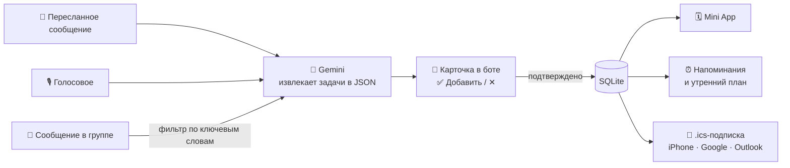

<div align="center">

---

## 💡 Зачем

У человека десятки рабочих и личных чатов. «Давай в пятницу в 19:00», «митап перенесли на среду»,
«заказ ждёт в пункте выдачи до 12-го» — тонут в переписке за пару часов.

Task Tracker превращает такие сообщения в задачи и напоминания **без ручного ввода**:

- 🤖 **ИИ понимает живую речь** — «завтра после обеда», «в эту пятницу», голосовые.
- ✅ **Ничего не попадает в календарь без спроса** — каждую найденную задачу ты подтверждаешь одной кнопкой.
- ⏰ **Напоминания как тебе удобно** — за неделю, за день, за 15 минут, сколько угодно раз.
- 📱 **Работает с любым календарём** — iPhone, Google, Outlook, Samsung — через подписку.
- 💸 **Бесплатно для пользователя** — без Telegram Premium и без подключения аккаунта Google.

## ✨ Возможности

|                                                               | Что умеет                                                                                                                                                                                                                                                                                                                                                                                                                                    |
| ------------------------------------------------------------- | ---------------------------------------------------------------------------------------------------------------------------------------------------------------------------------------------------------------------------------------------------------------------------------------------------------------------------------------------------------------------------------------------------------------------------------------------------- |
| 📨**Пересылка**                                | Перешли боту любое сообщение — он найдёт в нём дела (название, дату, место, детали) и пришлёт карточку с кнопками «Добавить» / «✕». Даты считаются от времени*исходного* сообщения.                                                                                                                 |
| 🎙**Голосовые**                                | Надиктуй «завтра в 10 стоматолог, а в пятницу забрать посылку» — получишь две задачи.                                                                                                                                                                                                                                                                                            |
| 📸**Скриншоты и фото**                    | Скрин переписки из WhatsApp/Instagram, афиша, билет, фото записки → задачи. Закрывает чаты, куда бот не может попасть.                                                                                                                                                                                                                                                 |
| 💬**Ассистент на обычном языке** | «что у меня завтра?», «когда я свободен в четверг?», «что я обещал Мише?» — ответ по календарю. «Перенеси встречу на субботу», «отмени стоматолога», «отметь звонок сделанным» — правка с подтверждением кнопкой.                                                          |
| 🔄**Переносы вместо дублей**        | «Митап перенесли на среду» в группе или пересланное сообщение о уже известной встрече — ИИ сверяет с существующими задачами и предлагает «было → стало», а не создаёт дубль.                                                                                                                          |
| 🔁**Повторы**                                    | «Каждый вторник в 10 планёрка» → серия задач. Удалить можно одну или все следующие.                                                                                                                                                                                                                                                                                                |
| ⚠️**Пересечения**                          | Предупреждение, если новая встреча накладывается на уже запланированную.                                                                                                                                                                                                                                                                                                              |
| 👥**Групповые чаты**                       | Добавь бота в рабочий чат — он сам разбирает сообщения (новые дела, переносы, отмены) и присылает карточки в личку участникам.                                                                                                                                                                                                                 |
| ⏰**Гибкие напоминания**               | Любой набор: в момент начала, за 5/15/30 мин, за 1–2 ч, за 1–2 дня, за неделю или своё значение.**Умные напоминания:** ИИ подбирает время под тип дела (самолёт — за день и за 3 ч, созвон — за час и 10 мин).                                                                                        |
| 😴**«Напомни позже»**                     | Прямо в напоминании: «+15 мин», «+1 ч» или «✅ Сделано».                                                                                                                                                                                                                                                                                                                                                        |
| ☀️**Утренний план**                       | Список дел на сегодня в выбранный час (или выключить).                                                                                                                                                                                                                                                                                                                                                    |
| 🌙**Вечерний итог**                         | Что не отмечено за день — с кнопками «Всё на завтра» / «Всё сделано».                                                                                                                                                                                                                                                                                                                          |
| 🗓**Mini App**                                          | Календарь-сетка на месяц с листанием (кнопки или свайп), задачи любого дня — прошлого и будущего. У задачи — описание, место, напоминания; кнопки «Изменить», «Удалить», отметка «сделано». Можно добавить задачу вручную. Светлая и тёмная тема. |
| 🔗**Синхронизация**                        | Личная ссылка-подписка`.ics` — задачи сами появляются в календаре телефона.                                                                                                                                                                                                                                                                                                             |
| 📦**Пачки пересылок** | Переслал несколько сообщений подряд — ИИ читает их как одну переписку и понимает, о чём в итоге договорились («в 7?» → «давай в 8» → «ок» = встреча в 8). Один запрос вместо десяти. |
| 🏷**Категории, приоритеты, подзадачи** | ИИ сам ставит категорию (работа, личное, покупки, здоровье, учёба), отмечает срочное 🔥 и раскладывает списки: «купить торт, шарики, свечи» → чек-лист. В Mini App — цвета и фильтр по категориям. |
| ✨**Планирование дня** | `/plan`, кнопка в утреннем плане или в Mini App: ИИ расставляет дела без времени по свободным окнам между встречами с учётом приоритета. |
| 📊**Обзор и продуктивность недели** | `/week` и по воскресеньям в 18:00: сколько сделано, что нашёл ИИ, разбивка по категориям и советы на следующую неделю. В Mini App — карточка «Эта неделя». |
| ↗️**Встроенный режим** | В любом чате набери `@бот` — выбери задачу и отправь собеседнику карточку. Он нажмёт «Добавить себе» — и встреча у него в календаре. |
| 🔍**Поиск и «Отменить»** | Поиск по названию, месту, описанию и подзадачам. Удалил по ошибке — «Отменить» в течение 5 секунд. |
| 👋**Знакомство** | При первом открытии Mini App — 3 экрана о том, как пользоваться ботом. |
| 🌍**Три языка** | Русский, английский, кыргызский: бот, Mini App, описание и команды. Язык берётся из Telegram и меняется в настройках. |

## ⚙️ Как это работает



Всё работает в **одном процессе**: Telegram-бот (aiogram), веб-сервер для Mini App и календарной подписки (aiohttp)
и планировщик напоминаний, который раз в минуту проверяет, кому пора написать.

---

## 🚀 Быстрый старт

### Что понадобится

- **Python 3.11+** — проверить: `python3 --version`
- **cloudflared** — бесплатный туннель, чтобы Telegram мог открыть Mini App с твоего компьютера
- Аккаунт **Telegram** и аккаунт **Google** (для бесплатного ключа Gemini)

<details>
<summary>Как установить cloudflared</summary>

```bash
# macOS
brew install cloudflared

# Linux (Debian/Ubuntu)
curl -L https://github.com/cloudflare/cloudflared/releases/latest/download/cloudflared-linux-amd64.deb -o cloudflared.deb
sudo dpkg -i cloudflared.deb

# Windows
winget install --id Cloudflare.cloudflared
```

</details>

### 1. Создай бота

1. Открой [@BotFather](https://t.me/BotFather) → `/newbot` → придумай имя и username.
2. Сохрани **токен** вида `1234567890:AA...`.
3. Чтобы бот видел сообщения в группах: `/setprivacy` → выбери бота → **Disable**.
4. Для встроенного режима (`@бот` в любом чате): `/setinline` → выбери бота → введи подсказку, например `Найти задачу…`.

> [!IMPORTANT]
> Если бот уже был добавлен в группу до шага 3 — удали его из группы и добавь заново, иначе настройка не применится.

### 2. Получи ключ Gemini

Открой [Google AI Studio](https://aistudio.google.com/apikey) → **Create API key** → скопируй ключ.
Бесплатного тарифа хватает для теста и демо.

### 3. Установи проект

```bash
git clone <адрес-репозитория> telegram_task_tracker
cd telegram_task_tracker

python3 -m venv .venv
.venv/bin/pip install -r requirements.txt
```

> На Windows вместо `.venv/bin/...` используй `.venv\Scripts\...`

### 4. Запусти туннель

В **первом окне терминала**:

```bash
cloudflared tunnel --url http://localhost:8080
```

В выводе найди адрес вида `https://какие-то-слова.trycloudflare.com` — он понадобится на следующем шаге.
**Окно не закрывай.**

### 5. Заполни настройки

```bash
cp .env.example .env
```

Открой `.env` и впиши свои значения:

```env
BOT_TOKEN=1234567890:AA...
GEMINI_API_KEY=AIza...
PUBLIC_URL=https://какие-то-слова.trycloudflare.com
TIMEZONE=Asia/Bishkek
```

### 6. Запусти бота

Во **втором окне терминала**:

```bash
.venv/bin/python bot.py
```

Готово, если видишь:

```
INFO:aiogram.dispatcher:Run polling for bot @your_bot ...
```

Открой бота в Telegram → `/start`. Слева от поля ввода появится кнопка **«Календарь»** — это Mini App.

> [!NOTE]
> Адрес `trycloudflare.com` меняется при каждом запуске туннеля. После перезапуска обнови `PUBLIC_URL` в `.env`
> и перезапусти бота. Уже оформленные подписки на календарь при этом перестанут работать —
> для постоянной работы разверни бота на сервере (см. [Деплой](#-деплой)).

---

## 📖 Как пользоваться

### Команды бота

| Команда                               | Что делает                                                            |
| -------------------------------------------- | ------------------------------------------------------------------------------ |
| `/today`                                   | Задачи на сегодня                                               |
| `/tasks`                                   | Ближайшие задачи списком                                 |
| `/plan`                                    | ИИ спланирует день                                       |
| `/week`                                    | Продуктивность и обзор недели                            |
| `/settings`                                | Напоминания, утренний план и вечерний итог |
| `/calendar`                                | Подключить задачи к календарю телефона       |
| `/help`                                    | Что умеет бот                                                       |
| Кнопка**«Календарь»** | Открыть Mini App                                                        |

Команды появляются в меню бота (кнопка `/` у поля ввода) автоматически при запуске.

### Добавить задачу

- **Переслать** сообщение из любого чата боту.
- **Написать** боту своими словами: «в четверг в 15:00 созвон с заказчиком».
- **Надиктовать** голосовое или **прислать скриншот/фото**.
- **Написать с повтором**: «каждый вторник в 10 планёрка».
- **Добавить бота в группу** — он сам найдёт дела в сообщениях вроде «встреча завтра в 11».
  Голосовые и фото в группе он сам не слушает (это дорого и неприятно для участников): ответь на такое сообщение
  командой `/task` — задача придёт тебе в личку. В группе работают `/task` и `/help`.

Бот пришлёт карточку → нажми **✅ Добавить**. Новые задачи также видны в Mini App в блоке «Нужно подтвердить».

Или вручную: Mini App → выбери день в календаре → **+ Задача**.

### Настроить напоминания

- **По умолчанию для всех новых задач:** Mini App → внизу «⚙️ Напоминания и календарь» (или ⋯ → Настройки).
- **Для конкретной задачи:** нажми на задачу в Mini App → блок «Напомнить», или кнопка
  **«🔔 Настроить напоминания»** под подтверждённой карточкой.

Если включены **умные напоминания** (по умолчанию да), время для задач из чатов подбирает ИИ. Выбирай сколько угодно вариантов (до 10): готовые чипсы или «Своё: за N мин / ч / дн».
Для задач без времени («весь день») отсчёт идёт от 9:00 этого дня.

### Подключить календарь телефона

`/calendar` или Mini App → настройки → «Календарь телефона»:

| Календарь        | Как подключить                                                                                               |
| ------------------------- | ------------------------------------------------------------------------------------------------------------------------- |
| 🍎 iPhone / Mac           | Кнопка**iPhone** → «Подписаться»                                                                |
| 📅 Google                 | Кнопка**Google** → «Добавить»                                                                      |
| Outlook, Samsung и др. | Кнопка**Другой** скопирует ссылку → в календаре «Добавить по URL» |

> [!TIP]
> Календарь сам периодически перечитывает подписку: Apple — обычно в пределах 15–30 минут
> (в Календаре на Mac можно выставить «каждые 5 минут» в свойствах подписки), Google — раз в несколько часов.
> Для мгновенного результата есть кнопка «📅 В Google Календарь» под каждой подтверждённой задачей.

---

## 🧠 Роль ИИ и хранение данных

**Gemini** — «мозг» бота. На каждое сообщение он получает текст (или голос, или картинку) **вместе со списком задач пользователя** и решает, что нужно: создать задачу, изменить существующую или ответить на вопрос. Например:

```
«Миш, давай в эту пятницу после 7 в кофейне на Чуй, захвати ноутбук»
                              ↓
{ title: "Встреча с Мишей", start: "2026-10-09T19:00",
  location: "кофейня на Чуй", description: "Взять ноутбук" }
```

| Сообщение                                                                                                                         | Решение ИИ                                                                      |
| ------------------------------------------------------------------------------------------------------------------------------------------ | ---------------------------------------------------------------------------------------- |
| «перенеси встречу с Мишей на субботу»                                                                      | правка: пт 19:00 → сб 19:00                                                   |
| «когда я свободен в пятницу вечером?»                                                                       | ответ: «после 20:00» (учёл митап и встречу)                 |
| «Митап переносим на среду, 18:00» (в группе)                                                                 | правка у всех участников, у кого есть эта задача  |
| пересланное «давай в пятницу в 19, захвати ноутбук» о уже записанной встрече | не дубль, а «добавить в описание: взять ноутбук?» |
| скриншот переписки «в субботу в 15:00 у ЦУМа, не забудь билеты»                             | задача с местом и описанием                                       |
| «завтра в 21:40 рейс в Стамбул»                                                                                       | задача + напоминания за день и за 3 часа                   |

ИИ **ничего не меняет сам**: новые задачи и правки приходят карточками с кнопками, последнее слово за пользователем.
Бесплатный лимит Gemini считается на каждую модель отдельно, поэтому при перегрузке бот автоматически
переключается на запасные модели (`GEMINI_FALLBACKS`).

**SQLite** — файл `tasks.db`, где лежат задачи, напоминания и настройки. Нужен, чтобы ничего не терялось при
перезапуске бота, и чтобы бот, Mini App и календарная подписка видели одни и те же данные. Встроен в Python —
ничего не нужно устанавливать. Для большого числа пользователей заменяется на PostgreSQL.

## 🔧 Переменные окружения

| Переменная | Обязательна | По умолчанию                       | Описание                                                                                                                                            |
| -------------------- | :--------------------: | --------------------------------------------- | ----------------------------------------------------------------------------------------------------------------------------------------------------------- |
| `BOT_TOKEN`        |           ✅           | —                                            | Токен бота от @BotFather                                                                                                                         |
| `GEMINI_API_KEY`   |           ✅           | —                                            | Ключ из Google AI Studio                                                                                                                              |
| `PUBLIC_URL`       |    для Mini App    | —                                            | Публичный HTTPS-адрес (туннель или сервер). Без него бот работает, но без Mini App и подписки |
| `TIMEZONE`         |                        | `Asia/Bishkek`                              | Часовой пояс для дат и напоминаний ([список](https://en.wikipedia.org/wiki/List_of_tz_database_time_zones))               |
| `GEMINI_MODEL`     |                        | `gemini-3.5-flash-lite`                     | Основная модель Gemini — самая быстрая из проверенных (~1–2 с на ответ)                                    |
| `GEMINI_FALLBACKS` |                        | `gemini-3.1-flash-lite,gemini-flash-latest` | Запасные модели при лимите, перегрузке или тайм-ауте (20 с)                                                    |
| `PORT`             |                        | `8080`                                      | Порт веб-сервера                                                                                                                              |
| `DB_PATH`          |                        | `tasks.db`                                  | Файл базы SQLite                                                                                                                                    |

## 🗂 Структура проекта

```
telegram_task_tracker/
├── bot.py            # бот, веб-сервер, API Mini App, планировщик напоминаний
├── texts.py          # тексты бота на русском, английском и кыргызском
├── webapp.html       # Mini App (один файл, без сборки)
├── test_bot.py       # проверки логики
├── requirements.txt  # aiogram, google-genai
├── .env.example      # шаблон настроек
└── tasks.db          # база SQLite (создаётся сама, в git не попадает)
```

<details>
<summary>HTTP-эндпоинты</summary>

| Метод | Путь                            | Назначение                                                                                                               |
| ---------- | ----------------------------------- | ---------------------------------------------------------------------------------------------------------------------------------- |
| `GET`    | `/`                               | Mini App                                                                                                                           |
| `GET`    | `/api/tasks?from=&to=`            | Задачи за период, неподтверждённые задачи, настройки, ссылки календаря |
| `GET`    | `/api/search?q=`                  | Поиск по названию, месту, описанию и подзадачам |
| `POST`   | `/api/tasks`                      | Создать задачу вручную                                                                                         |
| `POST`   | `/api/undo`                       | Вернуть удалённое («Отменить») |
| `POST`   | `/api/plan`, `/api/plan/apply`    | План дня от ИИ и его применение |
| `POST`   | `/api/tasks/{id}`                 | Подтвердить / отметить / изменить / удалить задачу                                         |
| `POST`   | `/api/settings`                   | Напоминания по умолчанию и час утреннего плана                                             |
| `GET`    | `/cal/{uid}-{подпись}.ics` | Календарная подписка                                                                                            |
| `GET`    | `/subscribe/cal/...`              | Редирект на`webcal://` для iPhone                                                                                   |

Запросы `/api/*` принимаются только с подписанными данными Telegram (`initData`) — чужие задачи не прочитать и не изменить.
Ссылка календаря подписана HMAC, подобрать чужую нельзя.

</details>

## 🧪 Тесты

```bash
.venv/bin/python test_bot.py
```

Проверяются: разбор дат, ссылки в календарь, формат `.ics`, расписание напоминаний
(несколько на задачу, «напомни позже», утренний план), пачки пересылок, план дня, статистика недели,
«Отменить», встроенный режим, переводы на все три языка и защита от некорректных данных.

## 🩺 Если что-то не работает

| Симптом                                                                | Решение                                                                                                                                                                                      |
| ----------------------------------------------------------------------------- | --------------------------------------------------------------------------------------------------------------------------------------------------------------------------------------------------- |
| `KeyError: 'BOT_TOKEN'`                                                     | Нет файла`.env` или в нём пустое значение. В `.env` пишется *имя=значение*, а не наоборот.                                         |
| `Conflict: terminated by other getUpdates request`                          | Бот запущен дважды. Останови лишнюю копию (`Ctrl+C`).                                                                                                          |
| Mini App пишет «Открой из Telegram»                            | Открываешь страницу в браузере — нужно через кнопку «Календарь» в боте.                                                                 |
| Кнопка «Календарь» не открывается               | Туннель не запущен или`PUBLIC_URL` устарел. Перезапусти туннель, обнови `.env`, перезапусти бота.                              |
| В группе бот молчит                                           | Отключи privacy mode в @BotFather и добавь бота в группу заново. Карточки приходят только тем, кто нажал`/start` у бота.    |
| «Не получилось разобрать, попробуй позже» | Все модели Gemini упёрлись в бесплатный лимит (по 5–15 запросов в минуту на модель) или нет сети. Подожди минуту. |
| Задача не появилась в Google Календаре             | Google обновляет подписки раз в несколько часов — это нормально.                                                                                    |

## ☁️ Деплой

Для постоянной работы нужен сервер с HTTPS. Подойдёт любой VPS или PaaS (Railway, Render, Fly.io):

1. Скопируй проект, установи зависимости.
2. Задай переменные окружения, `PUBLIC_URL` — адрес сервера.
3. Запусти `python bot.py` как сервис (systemd, Docker, Procfile).
4. Подключи постоянный диск под `tasks.db`.

## 🗺 Планы

- [ ] Интеграция с проектом для рекламодателей и инфлюенсеров
- [ ] Подписка на расширенные функции через Telegram Stars
- [ ] Режим Telegram Business — автоматический разбор личных чатов для владельцев Premium
- [ ] Импорт истории чатов из экспорта Telegram Desktop
- [ ] Вычитка кыргызского перевода носителем языка

---

<div align="center">
Сделано на хакатоне · Python · aiogram · Gemini · Telegram Mini Apps
</div>
